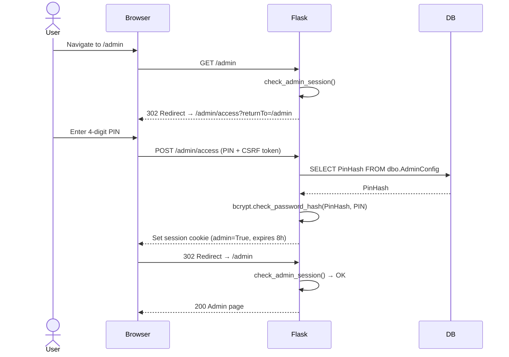
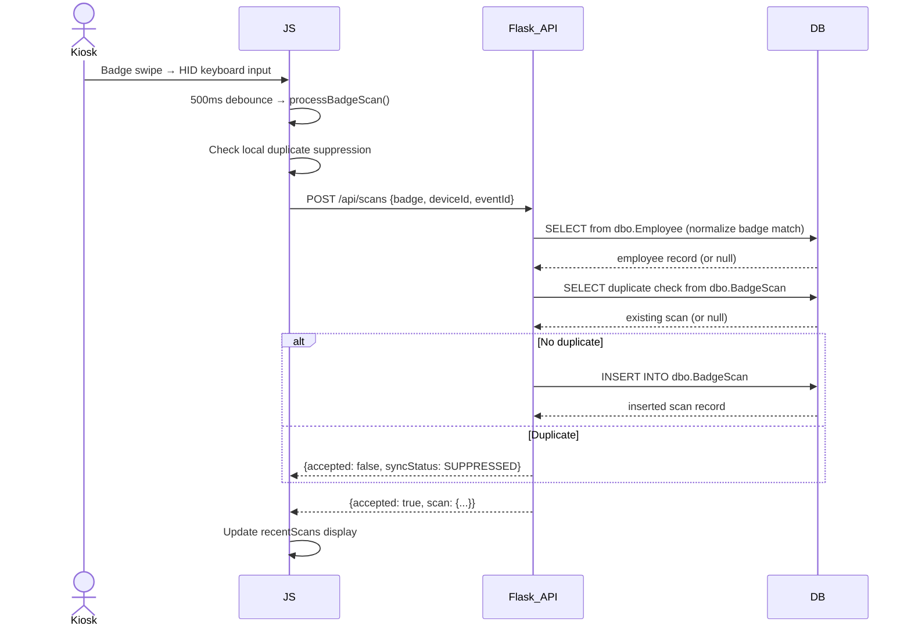
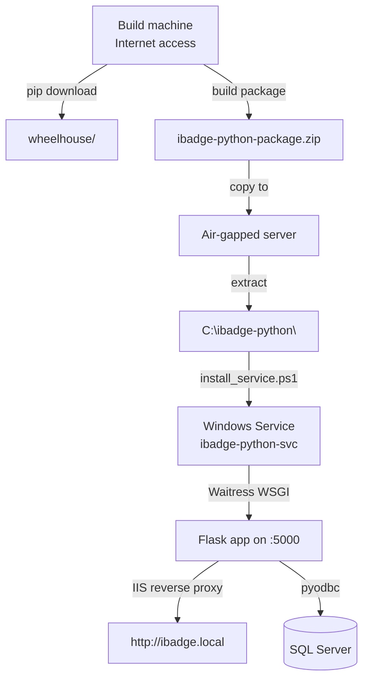

# PYTHON_REBUILD_ARCHITECTURE.md
# iBadge Python Rebuild — Architecture Design

> Generated: 2026-06-19

---

## 1. Recommended Stack

| Concern | Choice | Rationale |
|---|---|---|
| Framework | Flask 3.x | Lightweight, proven, Jinja2 native, easy Windows service deployment |
| Templates | Jinja2 (via Flask) | Server-rendered HTML; no React/Node required |
| Database | pyodbc + SQL Server | Direct ODBC connection; no ORM; mirrors the existing parameterized query model |
| Auth/Sessions | Flask-Login + Flask-WTF (CSRF) | Minimal, auditable, session-cookie based |
| Password hashing | bcrypt (passlib) | Match existing bcrypt hash from `dbo.AdminConfig` |
| PDF generation | ReportLab or WeasyPrint | PDF reports (local, no external service) |
| CSV parsing | Python stdlib `csv` module | No external dependency needed |
| Config | configparser (.ini files) | Dev/test/prod config with no secrets in code |
| Logging | Python stdlib `logging` + rotating file handler | No external dependency |
| Testing | pytest | Unit + integration + smoke tests |
| Service wrapper | NSSM or WinSW | Install as Windows Service |

---

## 2. Runtime Boundaries

```
┌──────────────────────────────────────────────────────────────────┐
│  Windows Server                                                  │
│                                                                  │
│  ┌────────────────────────────────────────────────────────────┐  │
│  │  IIS (optional reverse proxy)                              │  │
│  │  Site: ibadge.local or http://localhost:5000              │  │
│  └─────────────────────────┬──────────────────────────────────┘  │
│                            │ HTTP                                 │
│  ┌─────────────────────────▼──────────────────────────────────┐  │
│  │  Python Flask Application (Waitress WSGI)                  │  │
│  │  Port: 5000 (configurable)                                 │  │
│  │                                                            │  │
│  │  ┌─────────┐  ┌────────────┐  ┌──────────┐  ┌─────────┐  │  │
│  │  │  Auth   │  │   Kiosk    │  │  Admin   │  │  API    │  │  │
│  │  │ module  │  │   module   │  │  module  │  │ routes  │  │  │
│  │  └─────────┘  └────────────┘  └──────────┘  └─────────┘  │  │
│  │                                                            │  │
│  │  ┌──────────────────────────────────────────────────────┐ │  │
│  │  │  Database Layer (pyodbc connection pool)              │ │  │
│  │  └──────────────────────────────────────────────────────┘ │  │
│  └────────────────────────────────────────────────────────────┘  │
│                                                                  │
│  ┌────────────────────────────────────────────────────────────┐  │
│  │  SQL Server (ibadge database)                              │  │
│  └────────────────────────────────────────────────────────────┘  │
└──────────────────────────────────────────────────────────────────┘
```

---

## 3. Module Ownership

| Module | Responsibility |
|---|---|
| `app/auth/` | PIN verification, session management, admin guard decorator |
| `app/core/` | Logging, audit, error handling, security headers, permissions |
| `app/database/` | Connection pool, base repository, all SQL queries |
| `app/modules/kiosk/` | Badge scan routes, QR check-in, email check-in, sync endpoints |
| `app/modules/admin/` | Admin dashboard, device config, event management, employee cache |
| `app/modules/review/` | Scan review, filtering, export (CSV/Excel/PDF) |
| `app/modules/attendees/` | Attendee list CRUD, CSV upload, QR token management |
| `app/templates/` | Jinja2 HTML templates |
| `app/static/` | CSS, JS, images, vendor assets |

---

## 4. Proposed Folder Structure

```
PythonApp/
│
├── app/
│   ├── __init__.py               # Flask application factory
│   ├── main.py                   # create_app(), register blueprints
│   ├── config.py                 # Config class hierarchy (Dev/Test/Prod)
│   ├── extensions.py             # Shared extension instances (login manager, CSRF)
│   │
│   ├── auth/
│   │   ├── __init__.py
│   │   ├── routes.py             # GET /admin/access, POST /admin/access
│   │   ├── service.py            # PIN verification, session grant, bcrypt compare
│   │   └── decorators.py         # @require_admin, @admin_session_required
│   │
│   ├── core/
│   │   ├── logging_config.py     # Rotating file handler setup
│   │   ├── audit.py              # Structured audit log writer
│   │   ├── errors.py             # Error handlers (404, 500, ApiError)
│   │   ├── security.py           # Security headers, CSP, CSRF helpers
│   │   └── permissions.py        # Role constants
│   │
│   ├── database/
│   │   ├── __init__.py
│   │   ├── connection.py         # pyodbc connection pool, get_connection()
│   │   ├── repositories/
│   │   │   ├── admin_config.py   # AdminConfig read/ensure
│   │   │   ├── devices.py        # Device, DeviceAssignment
│   │   │   ├── employees.py      # Employee SELECT, upsert
│   │   │   ├── events.py         # Event SELECT, INSERT, UPDATE
│   │   │   ├── scans.py          # BadgeScan SELECT, INSERT, UPDATE
│   │   │   ├── sync.py           # SyncBatch, retry
│   │   │   ├── attendee_lists.py # AttendeeList CRUD
│   │   │   ├── attendees.py      # Attendee CRUD, QrToken
│   │   │   └── check_in.py       # AttendanceCheckIn INSERT
│   │   └── sql/                  # Optional .sql files for complex queries
│   │
│   ├── modules/
│   │   ├── kiosk/
│   │   │   ├── __init__.py
│   │   │   ├── routes.py         # GET /, GET /registration
│   │   │   └── api.py            # POST /api/scans, /api/kiosk/check-in/*
│   │   │
│   │   ├── admin/
│   │   │   ├── __init__.py
│   │   │   ├── routes.py         # GET /admin, device/event/employee sub-routes
│   │   │   └── api.py            # Device config, event CRUD, employee upsert
│   │   │
│   │   ├── review/
│   │   │   ├── __init__.py
│   │   │   ├── routes.py         # GET /admin/review
│   │   │   ├── api.py            # GET /api/scans/review, GET /api/reports/export/*
│   │   │   └── export.py         # CSV, Excel, PDF builders
│   │   │
│   │   ├── attendees/
│   │   │   ├── __init__.py
│   │   │   ├── routes.py         # GET /admin/attendees
│   │   │   ├── api.py            # Full attendee-lists + attendees REST API
│   │   │   ├── csv_import.py     # CSV validation + bulk insert
│   │   │   └── qr.py             # QR token generation, send, revoke
│   │   │
│   │   └── sync/
│   │       ├── __init__.py
│   │       └── api.py            # GET /api/sync/refresh, POST /api/sync/retry
│   │
│   ├── templates/
│   │   ├── base.html             # Layout: nav, header, footer, security nonces
│   │   ├── auth/
│   │   │   └── pin_entry.html
│   │   ├── kiosk/
│   │   │   └── index.html        # Kiosk display page
│   │   ├── admin/
│   │   │   ├── dashboard.html
│   │   │   ├── review.html
│   │   │   └── attendees.html
│   │   └── errors/
│   │       ├── 404.html
│   │       └── 500.html
│   │
│   └── static/
│       ├── css/
│       │   └── ibadge.css        # Compiled/vendored styles
│       ├── js/
│       │   ├── kiosk.js          # Badge scanner, QR camera, offline queue
│       │   ├── admin.js          # Admin panel interactions
│       │   └── review.js         # Filter UI, chart, export preview
│       ├── img/
│       │   ├── ibadge-full.png
│       │   └── ibadge-favicon.png
│       └── vendor/
│           ├── lucide/           # Vendored icon SVGs or sprite
│           └── fonts/            # Local fonts if needed
│
├── config/
│   ├── appsettings.example.ini
│   ├── appsettings.dev.ini
│   ├── appsettings.test.ini
│   └── appsettings.prod.ini
│
├── deploy/
│   ├── install_service.ps1
│   ├── uninstall_service.ps1
│   ├── start_service.ps1
│   ├── stop_service.ps1
│   ├── create_offline_package.ps1
│   └── verify_install.ps1
│
├── wheelhouse/
│   └── README.md
│
├── logs/
│   └── README.md
│
├── tests/
│   ├── unit/
│   │   ├── test_auth.py
│   │   ├── test_csv_import.py
│   │   ├── test_qr.py
│   │   └── test_export.py
│   ├── integration/
│   │   ├── test_scan_routes.py
│   │   ├── test_attendee_routes.py
│   │   └── test_review_routes.py
│   └── smoke/
│       └── test_smoke.py
│
├── requirements.txt
├── requirements.lock.txt
├── run.py                        # Entry point: from app import create_app; app = create_app()
├── README.md
└── CHANGELOG.md
```

---

## 5. Authentication Flow



---

## 6. Badge Scan Flow



---

## 7. Authorization Model

| Route Pattern | Guard | Method |
|---|---|---|
| `/` | None | Public |
| `/registration` | None | Public |
| `/offline` | None | Public |
| `/login` | None | Disabled placeholder |
| `/admin/access` | None (PIN entry form) | Public |
| `/admin` | `@require_admin` | Session check |
| `/admin/review` | `@require_admin` | Session check |
| `/admin/attendees` | `@require_admin` | Session check |
| `/api/admin/pin/verify` | None (IS the auth endpoint) | Public |
| `/api/scans` | None (kiosk-sourced) | Public |
| `/api/kiosk/check-in/*` | None (kiosk-sourced) | Public |
| `/api/sync/*` | None (kiosk-sourced) | Public |
| `/api/devices/*` | None (kiosk-sourced) | Public |
| `/api/events` (GET) | None | Public |
| `/api/events` (POST/PUT) | `@require_admin` | Session check |
| `/api/reports/export/*` | `@require_admin` | Session check |
| `/api/attendee-lists/*` | `@require_admin` | Session check |
| `/api/attendees/*` | `@require_admin` | Session check |

**NEEDS VALIDATION:** The existing Next.js app has no API-level auth enforcement. All API routes are unprotected. The Python rebuild shall add `@require_admin` to all admin-only mutations.

---

## 8. Configuration Model

Config is loaded from `.ini` files, selected by `IBADGE_ENV` environment variable.

```ini
[database]
host = localhost
name = ibadge
user = ibadge_app
password =
encrypt = true
trust_server_certificate = true
connection_string =

[server]
port = 5000
debug = false
secret_key =

[admin]
session_ttl_hours = 8
default_pin_hash =

[kiosk]
duplicate_suppress_seconds = 30
reference_refresh_hours = 12
queue_retry_minutes = 2

[qr]
base_url =
check_in_path = /kiosk/check-in
notification_provider = MOCK

[paths]
export_root = ./exports
log_root = ./logs
```

---

## 9. Error Handling Model

| Error Type | HTTP Status | Response |
|---|---|---|
| Validation error | 400 | JSON `{error: {code, message}}` |
| Admin session required | 302 (HTML) / 401 (JSON) | Redirect to PIN page or 401 |
| Not found | 404 | JSON or HTML error page |
| Database error | 500 | Sanitized message; full detail in log only |
| Duplicate scan | 200 | `{accepted: false, syncStatus: SUPPRESSED}` |

---

## 10. Logging / Audit Model

```
logs/
├── app.log          # Rotating, 10MB per file, 5 backups — all request/app log
├── audit.log        # Rotating, 10MB per file, 10 backups — admin action audit trail
└── error.log        # ERROR and CRITICAL only — separate for alerting
```

Audit log JSON format per entry:
```json
{
  "timestamp": "2026-06-19T14:30:00Z",
  "level": "INFO",
  "action": "ADMIN_EVENT_CREATED",
  "user": "admin-session",
  "ip": "10.0.0.5",
  "details": {
    "event_id": 42,
    "event_name": "Excel Training"
  }
}
```

---

## 11. Deployment Model



**Service startup sequence:**
1. Service starts via NSSM / WinSW
2. Flask `create_app()` → loads config from `.ini`
3. pyodbc pool initialized, test connection executed
4. Optional columns on `dbo.Employee` detected and cached
5. Admin config row ensured (creates default if missing)
6. Waitress WSGI server begins serving on configured port
7. Application ready — logs startup event to audit log
